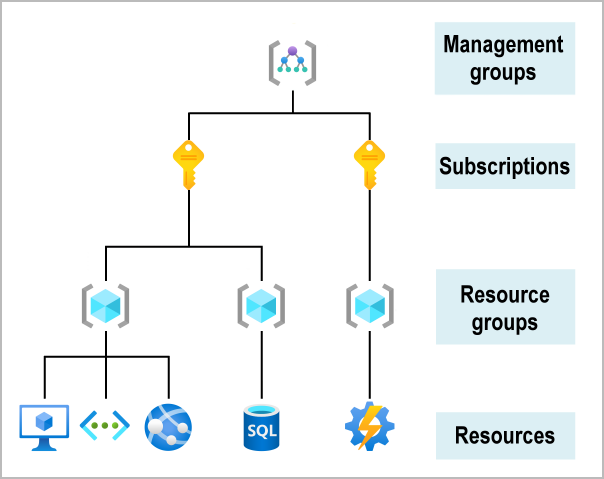
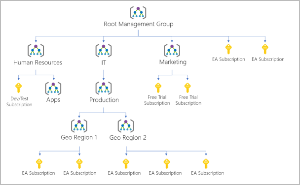

# Core Azure Concepts
## Contents Page
  - [Azure Fundamentals](#azure-fundamentals)
    - [Introduction](#introduction)
    - [What is Cloud Computing?](#what-is-cloud-computing)
    - [What is Azure?](#what-is-azure)
    - [Azure Services](#azure-services)
    - [Azure Accounts](#azure-accounts)
  - [Azure Fundamental Concepts](#azure-fundamental-concepts)
    - [Cloud Models](#cloud-models)
    - [Cloud Benefits and Considerations](#cloud-benefits-and-considerations)
    - [Cloud Services](#cloud-services)
  - [Azure Architectural Components](#azure-architectural-components)
    - [Azure Resource Structure](#azure-resource-structure)
    - [Azure Regions, Availability Zones (AZ), and Region Pairs](#azure-regions-availability-zones-az-and-region-pairs)
    - [Azure Resource Manager](#azure-resource-manager)
    - [Azure Subscriptions and Management Groups](#azure-subscriptions-and-management-groups)
## Azure Fundamentals
### Introduction
- Azure is a cloud computing platform with many services
- Services: remote storage, database hosting, centralised account mananagement, AI, IoT
### What is Cloud Computing?
- Cloud computing is the delivery of computing services over the internet by using a pay-as-you-go pricing model
- Cloud computing is a way to rent compute power and storage from someone else's datacenter
- Compute Power: the amount of processing the computer can do
- Storage: volume of data that is stored on the computer
- Only pay for the resources that are used (lower operating costs, scalability, efficiency)
- Cloud provides manage the upkeep of the system (backups, latest OS)
### What is Azure?
- Azure offers: futureproofing, support for all languages and frameworks, hybrid cloud solution, security
- Azure provides AI and machine-learning services that can naturally communicate with your users through vision, hearing, and speech
- Storage solutions that dynamically grow
- Virtualisation: creating a virtual computing environment to partition a single physical computer into several virtual machines (VMs)
- Hypervisor: emulates all the functions of a computer/CPU in a VM
- Fabric Controller: creates the VMs
- Orchestrator: manages everything that happens in Azure (responding to user requests)
  - When user creates new VM, orchestrator packages everything needed
  - Picks the server rack and send the package to the Fabric Controller (creates the VM)
- Azure portal is a web-based, unified console that provides an alternative to command-line
### Azure Services
- Compute: scale computing capability on-demand and only pay for what you use
- Networking: connect cloud and on-prem infrastructures (VPN, load balancer)
- Storage: scale data and app storage needs in a secure way
- Mobile: build and deploy cross-platform/native apps for any mobile device 
- Databases: store databases on the cloud using the tools
- Web: build, deploy, manage and scale web apps
- Internet of Things (IoT): connect, monitor and manage IoT assets - analyse the data and take action
- Big Data: cluster services run analytics on a large amounts of data and makes decisions
- AI: use existing data to forecast future behaviours
- DevOps: automating software delivery to provide continuous value to users

### Azure Accounts
- You can create a free account to start with Azure, then upgrade with a new subscription

## Azure Fundamental Concepts
### Cloud Models
- Public Cloud: Services are offered over the internet and available to anyone. Resources (servers, storage) are owned by a third-party cloud service provider
  - pay for what you use, can easily scale up, can quickly provision/deprovision applications
- Private Cloud (on-prem): Computing resources used by a single organisation. They can be physically located at your on-site at the organisation
  - pay for hardware/maintenance, full control over resources/security, responsible for updates
- Hybrid Cloud: Combines public and private cloud by allowing data and applications to be shared between them
  - flexibility, control over where to run applications, control security
### Cloud Benefits and Considerations
- High Availability: based on the SLA, cloud-based apps can provide continuous user experience with no apparent downtime, even when things go wrong
- Scalability: apps in the cloud can scale vertically or horizontally
  - Vertical: increase the compute capacity to a VM (add RAM/CPU)
  - Horizontal: increase the compute capacity by adding instances (create more VMs)
- Elasticity: configure apps to use autoscaling, so your apps have the resources they need
- Agility: deploy and configure resources quickly as your app requirements change
- Geo-distribution: deploy apps globally to regional datacenters, ensuring the best performance for the customer
- Disaster Recovery: using cloud-based backup services, data replication, and geo-distribution, you can keep your data safe in the event of a disaster
- CapEx (Capital Expenditure): onprem - buying the equipment and maintaining it
- OpEx (Operational Expenditure): cloud - no upfront costs, only pay for what you use
### Cloud Services
- IaaS (Infrastructure-as-a-Service): This cloud service model is the closest to managing physical servers; a cloud provider will keep the hardware up-to-date, but operating system maintenance and network configuration is up to you as the cloud tenant
  - Advantages: apps can be made and deleted quickly, most flexible cloud service as users have control to configure the hardware 
- PaaS (Platform-as-a-Service): This cloud service model is a managed hosting environment. The cloud provider manages the virtual machines and networking resources, and the cloud tenant deploys their applications into the managed hosting environment
  - Advantages: more agile than IaaS (no configuration required), users can focus on app development as cloud provider handles platform management
  - Disadvantages: some limitations to a cloud platform that may affect how the app runs 
- SaaS (Software-as-a-Service): In this cloud service model, the cloud provider manages all aspects of the application environment, such as virtual machines, networking resources, data storage, and applications. The cloud tenant only needs to provide their data to the application managed by the cloud provider
  - Advantages: access to latest software is quick and easy, can use same app data from anywhere, pay-as-you-go pricing model
  - Disadvantages: using as-is software means you don't have control of features and there may be limitations

- Serverless Computing: enables developers to build applications faster by eliminating the need for them to manage infrastructure. The cloud service provider automatically provisions, scales, and manages the infrastructure required to run the code. Serverless architectures are highly scalable and event-driven, only using resources when a specific function or trigger occurs. The "serverless" name comes from the fact that the tasks associated with infrastructure provisioning and management are invisible to the developer. This approach helps teams increase their productivity and bring products to market faster
  
## Azure Architectural Components
### Azure Resource Structure
- The following image shows the top-down hierarchy of organization for these levels:

- Resources: instances of services that you create, like virtual machines, storage, or SQL databases
- Resource groups: resources are combined into resource groups, which act as a logical container into which Azure resources like web apps, databases, and storage accounts are deployed and managed
- Subscriptions: groups together user accounts and the resources that have been created by those user accounts. For each subscription, there are limits or quotas on the amount of resources that you can create and use. Organizations can use subscriptions to manage costs and the resources that are created by users, teams, or projects
- Management groups: help you manage access, policy, and compliance for multiple subscriptions. All subscriptions in a management group automatically inherit the conditions applied to the management group
### Azure Regions, Availability Zones (AZ), and Region Pairs
- Regions: geographical locations around the globe that contains atleast one but potentially multiple datacenters
- Azure assigns and controls the resources within each region to ensure workloads are appropriately balanced
- Azure has more global regions than any other cloud provider, giving you the flexibility to bring applications closer to your users
  - US DoD Central, US Gov Virginia, US Gov Iowa and more: these datacenters are operated by screened U.S. personnel and include additional compliance certifications
  - China East, China North, and more: these regions are available due to a partnership between Microsoft and 21Vianet, whereby Microsoft doesn't directly maintain the datacenters

- Availability Zones (AZ): physically separate datacenters within an Azure region
- Each availability zone is made up of one or more datacenters equipped with independent power, cooling, and networking
- There's a minimum of three zones within a single region
- AZs are set up to be an isolation boundary, if one zone goes down, the other continues working
- Availability zones are connected through high-speed, private fiber-optic networks
  - Zonal services: You pin the resource to a specific zone (VMs)
  - Zone-redundant services: The platform replicates automatically across zones (SQL Database)
  - Non-regional services: Services are always available from Azure geographies and are resilient to zone-wide outages as well as region-wide outages
  

- Region Pairs: each Azure region is always paired with another region within the same geography but atleast 300 miles away
- If a region in a pair was affected by a natural disaster, services would automatically failover to the other region in its region pair
- Example of region pair: West US paired with East US, South East Asia paired with East Asia
- You can use region pairs to provide reliable services and data redundancy

- Having a broadly distributed set of datacenters allows Azure to provide a high guarantee of availability
### Azure Resource Manager
- Resources: instances of services that you create, like virtual machines, storage, or SQL databases
- Resource group: container that holds related resources for an Azure solution. The resource group includes resources that you want to manage as a group. You decide which resources belong in a resource group based on what makes the most sense for your organization.
- All resources must be in a resource group, and a resource can only be a member of a single resource group
- Before any resource can be provisioned, you need a resource group for it to be placed in
  - Logical Grouping: resource groups exist to help manage and organize your Azure resources
  - Life Cycle: if you delete a resource group, all resources contained within it are also deleted
  - Authorisation: resource groups are also a scope for applying role-based access control (RBAC) permissions (limits access)
- Azure Resource Manager is the deployment and management service for Azure
- It provides a management layer that enables you to create, update, and delete resources in your Azure account
- You use management features like access control, locks, and tags to secure and organize your resources after deployment

- When a user sends a request from any of the Azure tools, APIs, or SDKs, Resource Manager receives the request
- It authenticates and authorizes the request
- Resource Manager sends the request to the Azure service, which takes the requested action
- Because all requests are handled through the same API, you see consistent results and capabilities in all the different tools
- Benefits of using Resource Manager
  - Manage your infrastructure through declarative templates rather than scripts. Resource Manager template is a JSON file that defines what you want to deploy to Azure
  - Deploy, manage, and monitor all the resources for your solution as a group, rather than handling these resources individually
  - Redeploy your solution throughout the development life cycle and have confidence your resources are deployed in a consistent states
### Azure Subscriptions and Management Groups
- Using Azure requires an Azure subscription
- A subscription provides you with authenticated and authorized access to Azure products and services
- An Azure subscription is a logical unit of Azure services that links to an Azure account
- An account can have one subscription or multiple subscriptions that have different billing models
- There are two types of subscription boundaries that you can use:
  - Billing Boundary: You can create multiple subscriptions for different types of billing requirements. Azure generates separate billing reports and invoices for each subscription
  - Access Control Boundary: Azure applies access-management policies at the subscription level, and you can create separate subscriptions to reflect different organizational structures#
- You organize subscriptions into containers called management groups and apply your governance conditions to the management groups
- All subscriptions within a management group automatically inherit the conditions applied to the management group
- All subscriptions within a single management group must trust the same Azure AD tenant
- For example, you can apply policies to a management group that limits the regions available for VM creation

- 10,000 management groups can be supported in a single directory
- A management group tree can support up to six levels of depth. This limit doesn't include the root level or the subscription level
- Each management group and subscription can support only one parent
- Each management group can have many children
- All subscriptions and management groups are within a single hierarchy in each directory