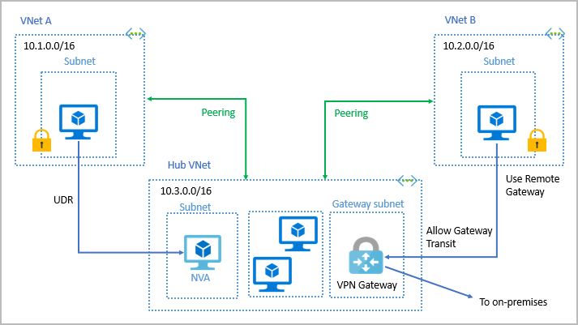
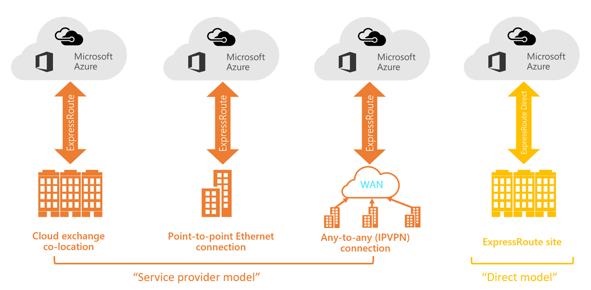

# Core Azure Services
## Contents Page

## Azure Compute Services
### Overview
- Azure compute is an on-demand computing service for running cloud-based applications
- It provides computing resources such as disks, CPU, RAM, networking, and operating systems
- Virtual Machines (VMs): software emulations of physical computers. They include a virtual processor, memory, storage, and host an OS. VMs provide IaaS as the user has full control over the OS, software, and hardware.
- Virtual Machine Scale Sets (VMSS): used to deploy and manage a set of identical VMs. With all VMs configured the same, VMSS are designed to support true autoscale. The number of instances can go up and down with the demand, this can be manual, automated, or a combination of both
- Containers and Kubernetes: used to deploy and manage containers. Containers are lightweight, virtualized application environments designed to be quickly created, scaled out, and stopped dynamically
- App Service: allows you to quickly build, deploy, and scale enterprise-grade web, mobile, and API apps running on any platform. App Service is a platform as a service (PaaS) offering
- Functions: ideal when you're concerned only about the code running your service and not the underlying platform or infrastructure
### When to use Azure Virtual Machines
- VM Image: template used to create a VM. These templates already include an OS and often other software
- When to use VMs: during testing and development, when running applications on the cloud, when extending your on-prem datacenter to the cloud, during disaster recovery
- VMs are also used when you move from a physical server to the cloud (also known as lift and shift). You can create an image of the physical server and host it within a VM but, you are responsible for updating the OS and software being run
- Virtual Machine Scale Sets (VMSS): let you create and manage a group of identical, load-balanced VMs. The number of VM instances can automatically increase or decrease in response to demand or a defined schedule
- Azure Batch: enables large-scale parallel and high-performance computing (HPC) batch jobs with the ability to scale to tens, hundreds, or thousands of VMs
  - Installs applications and staging data
  - Runs jobs with as many tasks as you have
  - Identifies failures
  - Requeues work
  - Scales down the pool as work completes
- Azure provides the capability to use supercomputer-level compute power
### When to use Azure App Service
- App Service: enables you to build and host web apps, background jobs, mobile back-ends, and RESTful APIs in the programming language of your choice without managing infrastructure. It offers automatic scaling and high availability
- You pay for the Azure compute resources your app uses while it processes requests based on the App Service plan you choose
- Web Apps: App Service includes full support for hosting web apps by using ASP.NET, ASP.NET Core, Java, Ruby, Node.js, PHP, or Python
- API Apps: you can build REST-based web APIs by using your choice of language and framework
- WebJobs: used to run a program (.exe, Java, PHP, Python, or Node.js) or script (.cmd, .bat, PowerShell, or Bash) in the same context as a web app, API app, or mobile app
- Mobile Apps: quickly build a back end for iOS and Android apps
  - Store mobile app data in a cloud-based SQL database
  - Authenticate customers against common social providers (Google, Twitter)
  - Send push notifications
  - Execute custom back-end logic in C# or Node.js
### When to use Azure Containers Instances or Azure Kubernetes Service
- Containers: are lightweight and designed to be created, scaled out, and stopped dynamically. They are a virtualization environment. Unlike VMs, you don't manage the OS for a container.
- Docker: popular containerisation platform. Docker communicates natively with the system kernel. It shares resources between the containers
- Orchestrator: containers are managed through a container orchestrator, which can start, stop, and scale out application instances as needed. 
- There are two ways to manage both Docker and Microsoft-based containers in Azure: Azure Container Instances and Azure Kubernetes Service (AKS)
- Azure Container Instances: offers way to run a container in Azure without having to manage any virtual machines or adopt any additional services (PaaS)
- Azure Kubernetes Service (AKS): The task of automating, managing, and interacting with a large number of containers is known as orchestration. AKS is a complete orchestration service for containers
- Microservice Architecture: where you break solutions into smaller, independent pieces (frontend, backend, storage)
- Each microservice can be deployed and replaced without affecting any other service
### When to use Azure Functions
- Serverless computing is the abstraction of servers, infrastructure, and operating systems. Infrastructure isn't your responsibility (Azure handles it). Scaling and performance are handled automatically. You're billed for the resources you use
- Serverless computing includes the abstraction of servers, an event-driven scale, and micro-billing
- Azure Functions: can execute code in almost any modern language. Azure runs your code when it's triggered and automatically deallocates resources when the function is finished
- Functions can be either stateless or stateful. When they're stateless (the default), they behave as if they're restarted for each event. When they're stateful (Durable Functions), a context is passed through the function to track prior activity
- Azure Logic Apps: designed in a web-based designer and can execute logic triggered by Azure services without writing any code. 
### When to use Azure Virtual Desktop
- Azure Virtual Desktop: a desktop and application virtualization service that runs on the cloud
- It provide the best user experience and enhances security
  - Simplified Management: using Azure AD and RBACs to manage access to resources. This standardization lets admins identify issues through a single interface
  - Performance Management: load balance
  - Multi-session Windows 10 Deployment: enables multiple concurrent users on a single VM

## Azure Networking Services
### Virtual Network Fundamentals
- Virtual Networks (VNets): enable Azure resources, such as VMs, web apps, and databases, to communicate with each other, with users on the internet, and with your on-premises client computers. You can think of an Azure network as an extension of your on-premises network with resources that links other Azure resources
- Isolation and Segmentation: allows you to create multiple isolated VNets. You define a private IP address space by using either public (only exists within VNet) or private IP address ranges. You can divide that IP address space into subnets and allocate part of the defined address space to each named subnet
- Internet Communications: a VM in Azure can connect to the internet by default. You can enable incoming connections from the internet by assigning a public IP address to the VM or by putting the VM behind a public load balancer
- Communicate between Azure Resources:
  - Virtual networks can connect not only VMs but other Azure resources, such as the App Service Environment for Power Apps, Azure Kubernetes Service, and Azure virtual machine scale sets
  - You can use service endpoints to connect to other Azure resource types, such as Azure SQL databases and storage accounts, This approach enables you to link multiple Azure resources to virtual networks (security, optimal routing)
- Communicate with on-prem Resources: enable you to link resources together in your on-premises environment and within your Azure subscription. You can create a network that spans both your local and cloud environments
  - point-to-site virtual private networks: computer outside your organization, back into your corporate network, the client computer initiates an encrypted VPN connection to connect that computer to the Azure virtual network
  - site-to-site virtual private networks: links your on-premises VPN device or gateway to the Azure VPN gateway in a virtual network, the devices in Azure can appear as being on the local network
  - azure ExpressRoute: where you need greater bandwidth and even higher levels of security. ExpressRoute provides a dedicated private connectivity to Azure that doesn't travel over the internet
- Route Network Traffic: azure routes traffic between subnets on any connected virtual networks, on-premises networks, and the internet
  - Route Tables: allows you to define rules about how traffic should be directed between subnets
  - Border Gateway Protocol (BGP): works with Azure VPN gateways, Azure Route Server, or ExpressRoute to propagate on-premises BGP routes to Azure VNets
- Filter Network Traffic:
  - Network Security Groups: can contain multiple inbound and outbound security rules. You can define these rules to allow or block traffic
  - Network Virtual Appliances: a specialized VM that can be compared to a hardened network appliance. It carries out a particular network function, such as running a firewall
- Connect Virtual Networks: peering enables resources in each virtual network to communicate with each other. User-defined routes (UDR) are a significant update to Azure’s Virtual Networks that allows for greater control over network traffic flow. This method allows network administrators to control the routing tables between subnets within a VNet, as well as between VNets
  

### Virtual Network Settings
- Address Space: when you set up a VNet, you define the internal address space in Classless Interdomain Routing (CIDR) format. This address space needs to be unique within your subscription and any other networks that you connect to
- IP Addresses:
  - Subnet: within each virtual network address range, you can create one or more subnets that partition the virtual network's address space
  - Service Endpoints: you select from the list which Azure service endpoints you want to enable. Options include Azure Cosmos DB, Azure Service Bus, Azure Key Vault
  - NAT Gateway: a fully managed and highly resilient Network Address Translation (NAT) service. You can configure a subnet to use a static outbound IP address when accessing the internet
- Security:
  - BastionHost: provides a secure and seamless RDP/SSH connectivity to your VMs directly in the Azure portal over SSL
  - DDoS Protection Standard: is a premium service.
  - Firewall: is managed cloud-based network security service that protects your Azure Virtual Network resources
### VPN Gateway Fundamentals
- VPNs use an encrypted tunnel within another network
- Used to connect two or more trusted private networks to one another over an untrusted network
- You can deploy only one VPN gateway in each virtual network, but can use it to connect to multiple locations
- Policy-based VPN: specify statically the IP address of packets that should be encrypted through each tunnel
- Route-based VPN: the IP routing decides which one of these tunnel interfaces to use when sending each packet

### ExpressRoute Fundamentals
- ExpressRoute lets you extend your on-premises networks into the Microsoft cloud over a private connection with the help of a connectivity provider
- ExpressRoute connections don't go over the public Internet, offering more reliability, faster speeds, consistent latencies, and higher security
- Different layers of the Open Systems Interconnection (OSI) model:
  - Layer 2 (L2): This layer is the Data Link Layer, which provides node-to-node communication between two nodes on the same network
  - Layer 3 (L3): This layer is the Network Layer, which provides addressing and routing between nodes on a multi-node network
- Features and Benefits of ExpressRoute:
  - L3 Connectivity: address-level connectivity between your on-premises network and the cloud. These connections can be from a point-to-point or any-to-any network
  - Built-in Redundancy: each connectivity provider uses redundant devices to ensure that connections established are highly available
  - Dynamic Routing: uses the Border Gateway Protocol (BGP) routing protocol. BGP is used to exchange routes between on-prem networks and cloud resources, enabling dynamic routing
- ExpressRoute Connectivity Models:
  - Co-location at a Cloud Exchange: can normally offer both L2 and L3 connections between your infrastructure, which might be located in the co-location facility, and the cloud
  - Point-to-Point Ethernet Connection: provides L2 and L3 connectivity between your on-premises site and Azure. You can connect your datacenters to Azure by using the point-to-point links
  - Any-to-Any Networks: you can integrate your wide area network (WAN) with Azure by providing connections to your offices and datacenters
  - Directly from ExpressRoute Sites: connect directly into the Microsoft's global network at a peering location, placed across the world
  

- Security Considerations: your data doesn't travel over the public internet. Even if you have an ExpressRoute connection, DNS queries, certificate revocation list checking, and Azure Content Delivery Network requests are still sent over the public internet

## Azure Storage Services
### Azure Storage Fundamentals
- Azure Storage: a service that you can use to store files, messages, tables, and other types of information
- To begin using Azure Storage, you first create an Azure Storage account to store your data objects
- Your storage account will contain all of your Azure Storage data objects, such as blobs, files, and disks
- Storage accounts provide a unique namespace for your Azure Storage data, that's accessible from anywhere in the world over HTTP or HTTPS
### Disk Storage Fundamentals
- Disk Storage provides disks for Azure virtual machines, apps and other services can access and use these disks as needed
- Disk Storage allows data to be persistently stored and accessed from an attached virtual hard disk
- Disks come in many different sizes and performance levels (SSD, HDD)
- Azure virtual machines can use separate disks to store different data
### Azure Blob Storage Fundamentals
- Azure Blob Storage is an object storage solution for the cloud and can store massive amounts of data, such as text or binary data
- It is unstructured, meaning that there are no restrictions on the kinds of data it can hold
- Blob Storage can manage thousands of simultaneous uploads, massive amounts of video data, constantly growing log files, and can be reached from anywhere with an internet connection
- An advantage of blob storage over disk storage is that it does not require developers to think about or manage disks; data is uploaded as blobs, and Azure takes care of the physical storage needs
- Ideal For:
  - Serving images or documents directly to a browser
  - Storing files for distributed access
  - Streaming video and audio
  - Storing data for backup and restore, disaster recovery, and archiving
  - Storing data for analysis by an on-premises or Azure-hosted service
  - Storing up to 8 TB of data for virtual machines
- You store blobs in containers, which helps you organize your blobs depending on your business needs
### Azure Files Fundamentals
- Azure Files offers fully managed file shares in the cloud, accessible via Server Message Block and Network File System protocols
- Typical usage scenarios would be to share files anywhere in the world, diagnostic data, or application data sharing
- Use Azure Files for the following situations:
  - Store configuration files on a file share and access them from multiple VMs
  - Write data to a file share, and process or analyze the data later. For example, you might want to do this with diagnostic logs, metrics, and crash dumps
- You can also use Shared Access Signature (SAS) tokens to allow access to a private asset for a specific amount of time
### Blob Access Tiers
- Azure provides several access tiers, which you can use to balance your storage costs with your access needs
- Azure Storage offers different access tiers for your blob storage:
  - Hot Access Tier: Optimized for storing data that is accessed frequently (website images)
  - Cool Access Tier: Optimized for data that is infrequently accessed and stored for at least 30 days (invoices)
  - Archive Access Tier: Appropriate for data that is rarely accessed and stored for at least 180 days, with flexible latency requirements (backups)
- Only the hot and cool access tiers can be set at the account level. The archive access tier isn't available at the account level
- Hot, cool, and archive tiers can be set at the blob level, during upload or after upload
- Archive storage stores data offline and offers the lowest storage costs, but the highest cost to rehydrate and access the data

## Azure Database and Analytics Services
### Azure Cosmos DB
- Azure Cosmos DB is a globally distributed, multi-model database service
- You can elastically and independently scale throughput and storage across any number of Azure regions
- You can take advantage of fast data access by using any one of several popular APIs
- Azure Cosmos DB provides comprehensive SLA for throughput, latency, availability, and consistency guarantees
- Azure Cosmos DB supports schema-less data, which you can use to store data that's updated and maintained by users globally
- Azure Cosmos DB stores data in atom-record-sequence (ARS) format, which is then abstracted and projected as an API
### Azure SQL Database
- Azure SQL Database is a relational database based on the latest MSSQL Server database engine (PaaS)
- It handles most of the database management functions, such as upgrading, patching, backups, and monitoring, without user involvement
- Microsoft handles all updates to the SQL and operating system code when using SQL Database
- You can migrate your existing SQL Server databases using the Azure Database Migration Service
- Microsoft Data Migration Assistant can generate assessment reports that provide recommendations to help guide you through required changes prior to performing a migration
### Azure Database for MySQL
- Azure Database for MySQL offers several service tiers, each tier provides different performance and capabilities to support lightweight to heavyweight database workloads
- Dynamic scalability enables your database to transparently respond to rapidly changing resource requirements
- You only pay for the resources you need, and only when you need them
### Azure Database for PostgreSQL
- Azure Database for PostgreSQL is available in two deployment options: Single Server and Hyperscale (Citus)
- The Single Server deployment option offers three pricing tiers: Basic, General Purpose, and Memory Optimized
- The Hyperscale (Citus) option horizontally scales queries across multiple machines by using sharding
- Its query engine parallelizes incoming SQL queries across these servers for faster responses on large datasets
- The Hyperscale (Citus) deployment option supports multi-tenant applications, real-time operational analytics, and high throughput transactional workloads
### Azure SQL Managed Instance
- Azure SQL Managed Instance is a scalable cloud data service that provides the broadest SQL Server database engine compatibility with all the benefits of a PaaS
- Azure SQL Database and Azure SQL Managed Instance offer many of the same feature, but Azure SQL Managed Instance provides several other options
### Big Data and Analytics
- Microsoft Azure supports services to provide big data and analytic solutions, including Azure Synapse Analytics, Azure HDInsight, Azure Databricks, and Azure Data Lake Analytics#
- Azure Synapse Analytics: a limitless analytics service that brings together enterprise data warehousing and big data analytics
- Azure HDInsight: a fully managed, open-source analytics service for enterprises. HDInsight also supports a broad range of scenarios such as extraction, transformation, and loading (ETL), data warehousing, machine learning, and IoT
- Azure Databricks: helps you unlock insights from all your data and build AI solutions. Azure Databricks supports Python, Scala, R, Java, and SQL, as well as data science frameworks and libraries including TensorFlow, PyTorch, and scikit-learn
- Azure Data Lake Analytics: an on-demand analytics job service that simplifies big data. You write queries to transform your data and extract valuable insights. The analytics service can handle jobs of any scale instantly by setting the dial for how much power you need