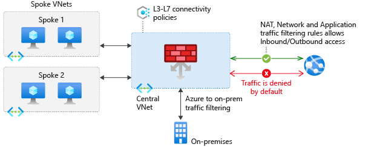

# General Security and Network Security Features
## Contents Page

## Security Threats on Azure
### Azure Security Center
- Azure Security Center is a monitoring service that provides visibility of your security posture across all of your services, both on Azure and on-prem
- Security Posture: refers to cybersecurity policies and controls, as well as how well you can predict, prevent, and respond to security threats
- Azure Security Center can:
  - Monitor security settings across on-premises and cloud workloads
  - Automatically apply required security settings to new resources as they come online
  - Provide security recommendations based on your current configurations, resources, and networks
  - Continuously monitor your resources and perform automatic security assessments to identify potential vulnerabilities
  - Use machine learning to detect and block malware from being installed on your VMs and other resources
  - Use adaptive application controls to define rules that list allowed applications that can run
  - Detect and analyze potential inbound attacks and investigate threats and any post-breach activity that might have occurred
  - Provide just-in-time access control for network ports (only allow traffic at the time you need it)

- Secure Score: a measurement of an organization's security posture
- Secure score is based on security controls, or groups of related security recommendations
- Following the secure score recommendations can help protect your organization from threats
- Secure score helps you:
  - Report on the current state of your organization's security posture
  - Improve your security posture by providing discoverability, visibility, guidance, and control
  - Compare with benchmarks and establish key performance indicators (KPIs)
### Azure Sentinel
- Azure Sentinel is Microsoft's cloud-based SIEM system. It uses intelligent security analytics and threat analysis
- Security Information and Event Management (SIEM): aggregates security data from many different sources
- Azure Sentinel enables you to:
  - Collect data across all users, devices, applications, and infrastructure, both on-premises and from multiple clouds
  - Detect previously undetected threats and minimize false positives by using Microsoft's analytics and threat intelligence
  - Investigate threats with AI
  - Respond to incidents rapidly by using built-in orchestration and automation of common tasks
- Connections are handled by built-in connectors or industry-standard log formats and APIs
- Built-in Analytics: use templates designed by Microsoft based on known threats, common attack vectors, and escalation chains for suspicious activity. These templates can be customized and search across the environment for any activity that looks suspicious. Some templates use machine learning behavioral analytics that are based on Microsoft proprietary algorithms
- Custom Analytics: rules that you create to search for specific criteria within your environment. You can preview the number of results that the query would generate (based on past log events) and set a schedule for the query to run. You can also set an alert threshold
### Azure Key Vault
- Azure Key Vault is a centralized cloud service for storing an application's secrets in a single, central location
- It provides secure access to sensitive information by providing access control and logging capabilities
- Azure Key Vault can help you:
  - Manage Secrets: used to securely store and control access to tokens, passwords, certificates, API keys, and other secrets
  - Manage Encryption Keys: used as a key management solution. Key Vault makes it easier to create and control the encryption keys that are used to encrypt your data
  - Manage SSL/TLS Certificates: enables you to provision, manage, and deploy your public and private Secure Sockets Layer/Transport Layer Security (SSL/TLS) certificates for your Azure resources and your internal resources
  - Store Secrets Backed by Hardware Security Modules (HSMs): these secrets and keys can be protected either by software or by FIPS 140-2 Level 2 validated HSMs
- The benefits of using Key Vault include:
  - Centralize application secrets enabling you to control their distribution, and reduces the chances that secrets are accidentally leaked
  - Securely store secrets and keys meaning access to Key Vault requires proper authentication and authorization
  - By using Key Vault, you can monitor and control access to your application secrets
  - Key Vault makes it easier to enroll and renew certificates from public certificate authorities (CAs)
  - Integrate with other Azure services that can then securely reference the secrets stored in Key Vault
### Azure Dedicated Host
- On Azure, virtual machines run on shared hardware that Microsoft manages
- Although the underlying hardware is shared, your VM workloads are isolated from workloads that other Azure customers run
- Azure Dedicated Host provides dedicated physical servers to host your Azure VMs for Windows and Linux
- You're charged per dedicated host, independent of how many VMs you deploy to it

## Secure Network Connectivity on Azure
### Defense in Depth
- The objective of defense-in-depth is to protect information and prevent it from being stolen by those who aren't authorized to access it
- A defense-in-depth strategy uses a series of mechanisms to slow the advance of an attack that aims at acquiring unauthorized access to data

- Each layer provides protection so that if one layer is breached, a subsequent layer is already in place to prevent further exposure
- This approach removes reliance on any single layer, it slows down an attack and provides alert telemetry that security teams can act upon, either automatically or manually
- Brief overview of the role of each layer:
  - The physical security layer is the first line of defense to protect computing hardware in the datacenter
  - The identity and access layer controls access to infrastructure and change control
  - The perimeter layer uses distributed denial of service (DDoS) protection to filter large-scale attacks before they can cause a denial of service for users
  - The network layer limits communication between resources through segmentation and access controls
  - The compute layer secures access to virtual machines
  - The application layer helps ensure that applications are secure and free of security vulnerabilities
  - The data layer controls access to business and customer data that you need to protect
- Physical Security: physically securing access to buildings and controlling access to computing hardware within the datacenter are the first line of defense
- Identity and Access: is all about ensuring that identities are secure, access is granted only to what's needed, and sign-in events and changes are logged
  - At this layer, it's important to:
  - Control access to infrastructure and change control
  - Use single sign-on (SSO) and multifactor authentication
  - Audit events and changes
- Perimeter: it's about protecting from network-based attacks against your resources. Identifying these attacks, eliminating their impact, and alerting you when they happen are important ways to keep your network secure
  - At this layer, it's important to:
  - Use DDoS protection to filter large-scale attacks before they can affect the availability of a system for users
  - Use perimeter firewalls to identify and alert on malicious attacks against your network
- Network: the focus is on limiting the network connectivity across all your resources to allow only what's required
  - At this layer, it's important to:
  - Limit communication between resources
  - Deny by default
  - Restrict inbound internet access and limit outbound access where appropriate
  - Implement secure connectivity to on-prem networks
- Compute: the focus in this layer is on making your compute resources secure and have the proper controls in place to minimize security issues
  - At this layer, it's important to:
  - Secure access to virtual machines
  - Implement endpoint protection on devices and keep systems patched and current
- Application: integrating security into the application development lifecycle helps reduce the number of vulnerabilities introduced in code
  - At this layer, it's important to:
  - Ensure that applications are secure and free of vulnerabilities
  - Store sensitive application secrets in a secure storage medium
  - Make security a design requirement for all application development
- Data: those who store and control access to data are responsible for ensuring that it's properly secured
  - In almost all cases, attackers are after data:
  - Stored in a database
  - Stored on disk inside virtual machines
  - Stored in software as a service (SaaS) applications, such as Office 365
  - Managed through cloud storage
- Security Posture: an organization's ability to protect from and respond to security threats
  - Confidentiality: the principle of least privilege means restricting access to information only to individuals explicitly granted access, at only the level that they need to perform their work
  - Integrity: a common approach used in data transmission is for the sender to create a unique fingerprint of the data by using a one-way hashing algorithm. The hash is sent to the receiver along with the data. The receiver recalculates the data's hash and compares it to the original to ensure that the data wasn't lost or modified in transit
    - Prevent unauthorized changes to information:
    - At rest: when it's stored
    - In transit: when it's being transferred from one place to another, including from a local computer to the cloud
  - Availability: ensure that services are functioning and can be accessed only by authorized users. Denial-of-service attacks are designed to degrade the availability of a system, affecting its users
### Azure Firewall
- Firewall: a network security device that monitors incoming and outgoing network traffic and decides whether to allow or block specific traffic based on a defined set of security rules
- You can create firewall rules that specify ranges of IP addresses
- Azure Firewall is a managed, cloud-based network security service that helps protect resources in your Azure virtual networks

- Azure Firewall is a stateful firewall. A stateful firewall analyzes the complete context of a network connection, not just an individual packet of network traffic
- Azure Firewall provides a central location to create, enforce, and log application and network connectivity policies across subscriptions and VNets
- Azure Firewall uses a static public IP address for your VNet resources, which enables outside firewalls to identify traffic coming from your VNet
- Azure Firewall provides many features, including:
  - Built-in high availability
  - Unrestricted cloud scalability
  - Inbound and outbound filtering rules
  - Inbound Destination Network Address Translation (DNAT) support
  - Azure Monitor logging
- With Azure Firewall, you can configure:
  - Application rules that define fully qualified domain names (FQDNs) that can be accessed from a subnet
  - Network rules that define source address, protocol, destination port, and destination address
  - Network Address Translation (NAT) rules that define destination IP addresses and ports to translate inbound requests
- Azure Application Gateway also provides a firewall that's called the web application firewall (WAF)
- WAF provides centralized, inbound protection for your web applications against common exploits and vulnerabilities
- Azure Front Door and Azure Content Delivery Network also provide WAF services
### Azure DDoS Protection
- A distributed denial of service (DDoS) attack attempts to overwhelm and exhaust an application's resources, making the application slow or unresponsive to legitimate users
- DDoS attacks can target any resource that's publicly reachable through the internet, including websites
- Azure DDoS Protection (Standard) helps protect your Azure resources from DDoS attacks
- DDoS Protection service helps protect your applications by analyzing and discarding DDoS traffic at the Azure network edge, before it can affect your service

- A cleverly designed DDoS attack can cause you to increase your resource allocation, which incurs unneeded expense
- DDoS Protection Standard helps ensure that the network load you process reflects customer usage (credit for any unneeded expense from DDoS)
- DDoS Protection provides these service tiers:
  - Basic: automatically enabled for free as part of your Azure subscription. It provides always-on traffic monitoring and real-time mitigation of common network-level attacks and ensures that Azure infrastructure itself is not affected during a large-scale DDoS attack
  - Standard: provides additional mitigation capabilities that are tuned specifically to Azure Virtual Network resources. Protection policies are tuned through dedicated traffic monitoring and machine learning algorithms. Policies are applied to public IP addresses, which are associated with resources deployed in virtual networks such as Azure Load Balancer and Application Gateway
- The Standard service tier can help prevent:
  - Volumetric Attacks: goal of this attack is to flood the network layer with a substantial amount of seemingly legitimate traffic
  - Protocol Attacks: render a target inaccessible by exploiting a weakness in the layer 3 and layer 4 protocol stack
  - Resource-layer Attacks: target web application packets to disrupt the transmission of data between hosts
### Network Security Groups
- A network security group enables you to filter network traffic to and from Azure resources within an Azure virtual network
- NSGs can contain multiple inbound and outbound security rules that enable you to filter traffic to and from resources by source and destination IP address, port, and protocol
- A network security group can contain as many rules as you need, each rule specifies these properties:
  - Name: a unique name for the NSG
  - Priority: a number between 100 and 4096. Rules are processed in priority order, with lower numbers processed before higher numbers
  - Source/Destination: a single IP address or IP address range, service tag, or application security group
  - Protocol: TCP, UDP, or Any
  - Direction: whether the rule applies to inbound or outbound traffic
  - Port Range: a single port or range of ports
  - Action: allow or deny
- When you create a network security group, Azure creates a series of default rules to provide a baseline level of security
- You can't remove the default rules, but you can override them by creating new rules with higher priorities
### Combine Azure Services
- Perimeter Layer: is about protecting your organization's resources from network-based attacks
- Identifying these attacks, alerting the appropriate security teams, and eliminating their impact are important to keeping your network secure
- To do this:
  - Use Azure DDoS Protection to filter large-scale attacks before they can cause a denial of service for users
  - Use perimeter firewalls with Azure Firewall to identify and alert on malicious attacks against your network
- Network Layer: the focus is on limiting network connectivity across all of your resources to allow only what's required
- Segment your resources and use network-level controls to restrict communication to only what's needed
- Use network security groups to create rules that define allowed inbound and outbound communication at this layer
- Here are some recommended practices:
  - Limit communication between resources by segmenting your network and configuring access controls
  - Deny by default
  - Restrict inbound internet access and limit outbound where appropriate
  - Implement secure connectivity to on-premises networks
- Network Security Groups and Azure Firewall:
  - Azure Firewall complements the functionality of network security groups. Together, they provide better defense-in-depth network security
  - NSGs provide distributed network-layer traffic filtering to limit traffic to resources within virtual networks in each subscription
  - Azure Firewall is a fully stateful, centralized network firewall as a service
  - It provides network-level and application-level protection across different subscriptions and virtual networks
- Azure Application Gateway and Azure Firewall:
  - WAF is a feature of Azure Application Gateway that provides your web applications with centralized, inbound protection against common exploits and vulnerabilities
  - Azure Firewall provides:
    - Inbound protection for non-HTTP/S protocols (for example, RDP, SSH, and FTP)
    - Outbound network-level protection for all ports and protocols
    - Application-level protection for outbound HTTP/S
  - Combining them provides more layers of protection