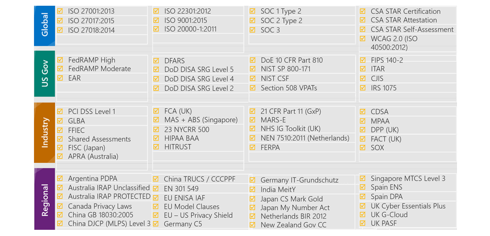

# Identity, Governance, Privacy, and Compliance Features
## Contents Page
  - [Azure Identity Services](#azure-identity-services)
    - [Authentication and Authorization](#authentication-and-authorization)
    - [Azure Active Directory (Azure AD)](#azure-active-directory-azure-ad)
    - [Multifactor Authentication and Conditional Access](#multifactor-authentication-and-conditional-access)
  - [Cloud Governance Strategy](#cloud-governance-strategy)
    - [Azure Role-Based Access Control](#azure-role-based-access-control)
    - [Resource Locks](#resource-locks)
    - [Tags (Organize Azure Resources)](#tags-organize-azure-resources)
    - [Azure Policy](#azure-policy)
    - [Azure Blueprints](#azure-blueprints)
    - [Cloud Adoption Framework](#cloud-adoption-framework)
    - [Subscription Governance Strategy](#subscription-governance-strategy)
  - [Privacy, Compliance, and Data Protection Standards on Azure](#privacy-compliance-and-data-protection-standards-on-azure)
    - [Compliance Terms and Requirements](#compliance-terms-and-requirements)
    - [Microsoft Privacy Statement, the Online Services Terms, and the Data Protection Addendum](#microsoft-privacy-statement-the-online-services-terms-and-the-data-protection-addendum)
    - [Trust Center](#trust-center)
    - [Azure Compliance Documentation](#azure-compliance-documentation)
    - [Azure Government](#azure-government)
    - [Azure China 21Vianet](#azure-china-21vianet)
## Azure Identity Services
### Authentication and Authorization
- Authentication: is the process of establishing the identity of a person or service that wants to access a resource
- It involves asking for legitimate credentials and provides the basis for creating a security principal for identity and access control
- Authorization: is the process of establishing what level of access an authenticated person or service has
- It specifies what data they're allowed to access and what they can do with it

### Azure Active Directory (Azure AD)
- Active Directory: gives organizations the ability to manage multiple on-prem infrastructure components and systems by using a single identity per user
- For on-prem environments, Active Directory running on Windows Server provides an identity and access management service that's managed by your own organization
- Azure AD: cloud-based identity and access management service, you control the identity accounts, but Microsoft ensures that the service is available globally
- When you connect Active Directory with Azure AD, Microsoft can help protect you by detecting suspicious sign-in attempts at no extra cost
- Azure AD is for:
  - IT Admins: use Azure AD to control access to applications and resources based on their business requirements
  - App Devs: use Azure AD to provide a standards-based approach for adding functionality to applications
  - Users: can manage their identities (self-service password reset)
  - Online Service Subscribers: Microsoft 365, Office 365, Azure, and Dynamics CRM Online tenant is automatically an Azure AD tenant. A tenant is a representation of an organization (own identity)
- Azure AD provides services such as:
  - Authentication: includes verifying identity to access applications and resources. It also includes providing functionality such as self-service password reset, MFA, list of banned passwords, and smart lockout services
  - Single Sign-On: enables you to remember only one username and one password to access multiple applications
  - Application Management: manage your cloud and on-premises apps by using Azure AD. Features like Application Proxy, SaaS apps, the My Apps portal, and SSO provide a better user experience.
  - Device Management: registration enables devices to be managed through tools like Microsoft Intune. It also allows for device-based Access policies to restrict access to known devices, regardless of the requesting user account
- Azure AD helps users access both external and internal resources
- External resources might include Microsoft Office 365, the Azure portal (other SaaS apps)
- Internal resources might include apps on your corporate network and intranet, along with any cloud applications developed within your organization
- Azure AD Connect synchronizes user identities between on-prem Active Directory and Azure AD
- Azure AD Connect synchronizes changes between both identity systems, so you can use features like SSO and MFA

### Multifactor Authentication and Conditional Access
- Multifactor Authentication: is a process where a user is prompted during the sign-in process for an additional form of identification
- These elements fall into three categories:
  - Something the user knows (email address and password)
  - Something the user has (code sent to phone)
  - Something the user is (fingerprint or face scan)
- Azure AD Multi-Factor Authentication: a Microsoft service that provides MFA capabilities. It enables users to choose an additional form of authentication during sign-in, such as a phone call or mobile app notification
- Conditional Access: is a tool that Azure Active Directory uses to allow (or deny) access to resources based on identity signals
- These signals include who the user is, where the user is, and what device the user is requesting access from
- Conditional Access also provides a more granular multifactor authentication experience for users (not being prompted for a code from a known device)
- Conditional Access comes with a What If tool, which helps you plan and troubleshoot your Conditional Access policies
- The What If tool enables you to test your proposed Conditional Access policies before you implement them

## Cloud Governance Strategy
### Azure Role-Based Access Control
- Azure provides built-in roles that describe common access rules for cloud resources but you can also define your own roles
- Each role has an associated set of access permissions that relate to that role 
- Role-based access control is applied to a scope, which is a resource or set of resources that this access applies to

- Scopes include: management groups (a collection of multiple subscriptions), single subscriptions, resource groups, and single resources
  - When you assign the Owner role to a user at the management group scope, that user can manage everything in all subscriptions within the management group
  - When you assign the Reader role to a group at the subscription scope, the members of that group can view every resource group and resource within the subscription
  - When you assign the Contributor role to an application at the resource group scope, the application can manage resources of all types within that resource group
- Use Azure RBAC when you need to:
  - Allow one user to manage VMs in a subscription and another user to manage virtual networks
  - Allow a database administrator group to manage SQL databases in a subscription
  - Allow a user to manage all resources in a resource group, such as virtual machines, websites, and subnets
  - Allow an application to access all resources in a resource group
- Azure RBAC is enforced on any action that's initiated against an Azure resource that passes through Azure Resource Manager
- Resource Manager is a management service that provides a way to organize and secure your cloud resources
- When you're assigned a role, RBAC allows you to perform certain actions, such as read, write, or delete (Allow Model)
- You can apply Azure RBAC to an individual person, a group or other special identity types (Service Principals and Managed Identities)
### Resource Locks
- A resource lock prevents resources from being accidentally deleted or changed
- Think of a resource lock as a warning system that reminds you that a resource should not be deleted or changed
- You can apply locks to a subscription, a resource group, or an individual resource and set the lock level to CanNotDelete or ReadOnly
- To modify a locked resource, you must first remove the lock, then you can apply any action you have permissions to perform
- To make the protection process more robust, you can combine resource locks with Azure Blueprints
- Azure Blueprints enables you to define the set of standard Azure resources that your organization requires (certain Resource Locks must exist)
- Azure Blueprints can automatically replace the resource lock if that lock is removed
### Tags (Organize Azure Resources)
- Tags provide extra information, or metadata, about your resources
- This metadata is useful for: resource management, cost, security, governance, and regulatory compliance
- Governance: describes the general process of establishing rules and policies and ensuring that those rules and policies are enforced
- A resource tag consists of a name and a value. You can assign one or more tags to each Azure resource
- Keep in mind that you don't need to enforce that a specific tag is present on all of your resources (can be left blank)
### Azure Policy
- Azure Policy is a service in Azure that enables you to create, assign, and manage policies that control or audit your resources
- These policies enforce different rules across your resource configurations so that those configurations stay compliant with corporate standards
- Azure Policy enables you to define both individual policies and groups of related policies, known as initiatives
- Azure Policy evaluates your resources and highlights resources that aren't compliant with the policies you've created
- Create a policy definition: a policy definition expresses what to evaluate and what action to take
- Assign the definition to resources: a policy assignment is a policy definition that takes place within a specific scope
- Review the evaluation results: each resource is marked as compliant or noncompliant
- Like a policy assignment, an initiative assignment is an initiative definition that's assigned to a specific scope of a management group, a subscription, or a resource group
### Azure Blueprints
- With Azure Blueprints you can define a repeatable set of governance tools and standard Azure resources that your organization requires
- Azure Blueprints orchestrates the deployment of various resource templates and other artifacts, such as: role assignments, policy assignments, ARM templates, and resource groups
- The relationship between the blueprint definition (what should be deployed) and the blueprint assignment (what was deployed) is preserved
- Each component in the blueprint definition is known as an artifact
### Cloud Adoption Framework
- The Cloud Adoption Framework for Azure provides you with proven guidance to help with your cloud adoption journey
- It helps you create and implement the business and technology strategies needed to succeed in the cloud

- Define your Strategy: here, you answer why you're moving to the cloud and what you want to get out of cloud migration
  - Define and document your motivations: meeting with stakeholders and leadership can help you answer why you're moving to the cloud
  - Document business outcomes: meet with leadership from your finance, marketing, sales, and human resource groups to help you document your goals
  - Evaluate financial considerations: measure objectives and identify the return expected from a specific investment
  - Understand technical considerations: evaluate those technical considerations through the selection and completion of your first technical project
- Make a plan: here, you build a plan that maps your aspirational goals (business goals) to specific actions
  - Digital estate: create an inventory of the existing digital assets and workloads that you plan to migrate to the cloud
  - Initial organizational alignment: ensure that the right people are involved in your migration efforts, both from a technical standpoint and from a cloud governance standpoint
  - Skills readiness plan: build a plan that helps individuals build the skills they need to operate in the cloud
  - Cloud adoption plan: build a comprehensive plan that brings together the development, operations, and business teams toward a shared cloud adoption goal
- Ready your organization: here, you create a landing zone, or an environment in the cloud to begin hosting your workloads
  - Azure setup guide: review the Azure setup guide to become familiar with the tools and approaches you need to use to create a landing zone
  - Azure landing zone: begin to build out the Azure subscriptions that support each of the major areas of your business. A landing zone includes cloud infrastructure as well as governance, accounting, and security capabilities
  - Expand the landing zone: refine your landing zone to ensure that it meets your operations, governance, and security needs
  - Best practices: start with recommended and proven practices to help ensure that your cloud migration efforts are scalable and maintainable
- Adopt the cloud: here, you begin to migrate your applications to the cloud in two stages Migrate and Innovate
  - Migrate:
    - Migrate your first workload: use the Azure migration guide to deploy your first project to the cloud
    - Migration scenarios: use additional in-depth guides to explore more complex migration scenarios
    - Best practices: check in with the Azure cloud migration best practices checklist to verify that you're following recommended practices
    - Process improvements: identify ways to make the migration process scale while requiring less effort
  - Innovate:
    - Business value consensus: verify that investments in new innovations add value to the business and meet customer needs
    - Azure innovation guide: use this guide to accelerate development and build a minimum viable product (MVP) for your idea
    - Best practices: verify that your progress maps to recommended practices before you move forward
    - Feedback loops: check in frequently with your customers to verify that you're building what they need
- Govern and manage your cloud environments: here, you begin to form your cloud governance and cloud management strategies
  - Govern:
    - Methodology: consider your end state solution. Then define a methodology that incrementally takes you from your first steps all the way to full cloud governance
    - Benchmark: use the governance benchmark tool to assess your current state and future state to establish a vision for applying the framework
    - Initial governance foundation: create an MVP that captures the first steps of your governance plan
    - Improve the initial governance foundation: iteratively add governance controls that address risks as you progress toward your end state solution
  - Manage:
    - Establish a management baseline: define your minimum commitment to operations management. A management baseline is the minimum set of tools and processes that should be applied to every asset in an environment
    - Define business commitments: document supported workloads to establish operational commitments with the business and agree on cloud management investments for each workload
    - Expand the management baseline: apply recommended best practices to iterate on your initial management baseline
    - Advanced operations and design principles: for workloads that require a higher level of business commitment, perform a deeper architecture review to deliver on your resiliency and reliability commitments
### Subscription Governance Strategy
- There are three main aspects to consider when you create and manage subscriptions: billing, access control, and subscription limits
- Billing: you can create one billing report per subscription. When you define how many subscriptions you need and what to name them, take into account your internal billing requirements
- Access Control: when you design your subscription architecture, consider the deployment boundary factor (do you need separate subscriptions for test and development)
- Subscription Limits: subscriptions also have some resource limitations. Management groups are available to assist with managing subscriptions

## Privacy, Compliance, and Data Protection Standards on Azure
### Compliance Terms and Requirements
- Microsoft's online services build upon a common set of regulatory and compliance controls
- Think of a control as a known good standard that you can compare your solution against to ensure security

- UK Government G-Cloud: is a cloud computing certification for services used by government entities in the United Kingdom. Azure has received official accreditation from the UK government
### Microsoft Privacy Statement, the Online Services Terms, and the Data Protection Addendum
- The Microsoft Privacy Statement explains what personal data Microsoft collects, how Microsoft uses it, and for what purposes. It covers all of Microsoft's services, websites, apps, software, servers, and devices
- The Online Services Terms (OST) is a legal agreement between Microsoft and the customer. It details the obligations by both parties with respect to the processing and security of customer data and personal data
- The Data Protection Addendum (DPA) further defines the data processing and security terms for online services (compliance with laws)
### Trust Center
- The Trust Center showcases Microsoft's principles for maintaining data integrity in the cloud and how they implement and support security, privacy, compliance, and transparency in all their cloud products and services
- The Trust Center is a great resource for other people in your organization who might play a role in security, privacy, and compliance
### Azure Compliance Documentation
- The Azure compliance documentation provides you with detailed documentation about legal and regulatory standards and compliance on Azure
- There are also additional compliance resources, such as audit reports, privacy information, compliance implementations and mappings, and white papers and analyst reports
### Azure Government
- Azure Government is a separate instance of the Microsoft Azure service. It addresses the security and compliance needs of US federal agencies, state and local governments, and their solution providers
- Azure Government offers physical isolation from non-US government deployments and provides screened US personnel
### Azure China 21Vianet
- Azure China 21Vianet is operated by 21Vianet. It's a physically separated instance of cloud services located in China
- Azure agreements and contracts in China, where applicable, are signed between customers and 21Vianet