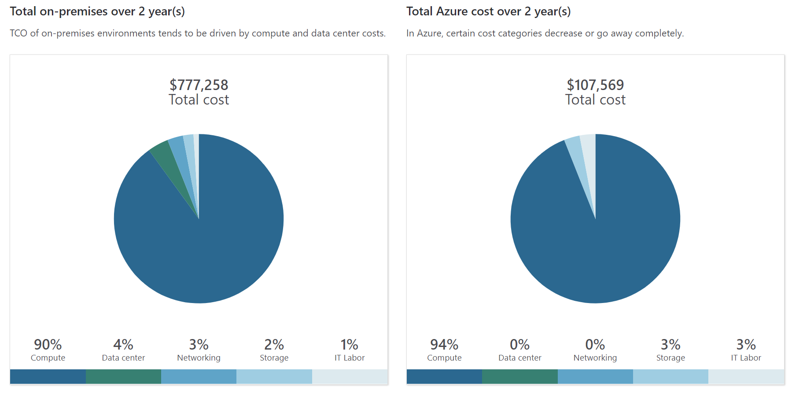

# Azure Cost Management and Service Level Agreements
## Contents Page
  - [Plan and Manage Azure Costs](#plan-and-manage-azure-costs)
    - [Total Cost of Ownership Calculator](#total-cost-of-ownership-calculator)
    - [Purchase Azure Services](#purchase-azure-services)
    - [Manage and Minimize Total Cost](#manage-and-minimize-total-cost)
  - [SLAs and Service Lifecycle](#slas-and-service-lifecycle)
    - [Service-Level Agreements (SLAs)](#service-level-agreements-slas)
    - [Define your Application SLA](#define-your-application-sla)
    - [Design your Application to Meet your SLA](#design-your-application-to-meet-your-sla)
    - [Preview Services and Preview Features](#preview-services-and-preview-features)
## Plan and Manage Azure Costs
### Total Cost of Ownership Calculator
- TCO Calculator: helps you estimate the cost savings of operating your solution on Azure over time, instead of in your on-prem datacenter
- You enter the details of your on-prem workloads. Then you review the suggested industry average cost (which you can adjust) for related operational costs
- These costs include: electricity, network maintenance, and IT labor
- You're then presented with a side-by-side report that you can use to compare to running the workload on Azure
- Working with the TCO Calculator involves three steps:
- Step 1: Define your Workloads
  - Enter the specifications of your on-premises infrastructure into the TCO Calculator, based on these four categories:
    - Servers: includes operating systems, virtualization methods, CPU cores, and memory (RAM)
    - Datbases: includes database types, server hardware, and the Azure service you want to use, which includes the expected maximum concurrent user sign-ins
    - Storage: includes storage type and capacity, which includes any backup or archive storage
    - Networking: includes the amount of network bandwidth you currently consume in your on-premises environment
- Step 2: Adjust Assumptions
  - Specify whether your current on-premises licenses are enrolled for Software Assurance, which can save you money by reusing those licenses on Azure
  - Specify whether you need to replicate your storage to another Azure region for greater redundancy
  - To improve the accuracy of the TCO Calculator results, you adjust the following values:
    - Electricity price per kilowatt hour (KWh)
    - Hourly pay rate for IT administration
    - Network maintenance cost as a percentage of network hardware and software costs
- Step 3: View the Report
  - Choose a time frame between one and five years and the TCO Calculator generates a report

  - For each category (compute, datacenter, networking, storage, and IT labor), you can also view a side-by-side comparison
### Purchase Azure Services
- Azure Subscriptions: provides you with access to Azure resources, such as VMs, storage, and databases
  - Free Trial: provides you with 12 months of popular free services, a credit to explore any Azure service for 30 days, and more than 25 services that are always free
  - Pay-as-you-go: enables you to pay for what you use by attaching a credit or debit card to your account. Organizations can apply for volume discounts and prepaid invoicing
  - Member Offers: existing membership to certain Microsoft products and services might provide you with credits for your Azure account and reduced rates on Azure services
- How do I purchase Azure services?
  - Through an Enterprise Agreement: larger customers (enterprise customers) can sign an Enterprise Agreement with Microsoft. This agreement commits them to spending a predetermined amount on Azure services over a period of three years
  - Directly from the web (Web Direct): purchase Azure services directly from the Azure portal website and pay standard prices. You're billed monthly, as a credit card payment or through an invoice
  - Through a Cloud Solution Provider: CSP is a Microsoft Partner who helps you build solutions on top of Azure. Your CSP bills you for your Azure usage at a price they determine
- What factors affect cost?
  - The way you use resources, your subscription type, and pricing from third-party vendors are common factors
  - This includes: resource type, usage meters, resource usage, subscription types, and Azure marketplace
- Does location or network traffic affect cost?
  - Location: different regions can have different associated prices as geographic regions can impact where your network traffic flows
  - Billing Zones: a factor in determining the cost of some Azure services
  - Bandwidth: refers to data moving in and out of Azure datacenters. Some inbound data transfers are free. For outbound data transfers, data transfer pricing is based on zones
  - A zone is a geographical grouping of Azure regions for billing purposes (Zone 1: Australia Central, West US, East US, Canada West, West Europe, France Central)
- How can I estimate the total cost?
  - Azure Pricing Calculator: displays Azure products in categories. You add these categories to your estimate and configure according to your specific requirements
  - You then receive an estimated price, with a detailed breakdown of the costs associated with each resource you added to your solution
### Manage and Minimize Total Cost
- Read the relevant documentation to understand how each of your choices is metered and billed
- Calculate your projected costs by using the Pricing Calculator and the Total Cost of Ownership (TCO) Calculator
- Azure Advisor identifies unused or underutilized resources and recommends unused resources that you can remove
- You can set spending limits to prevent accidental overrun
- Azure Reservations can save you up to 72 percent as compared to pay-as-you-go prices. To receive a discount, you reserve services and resources by paying in advance
- You should provision connected resources that are metered by bandwidth in the same Azure region to reduce egress traffic between them
- Azure Cost Management + Billing is a free service that helps you understand your Azure bill, manage your account and subscriptions, monitor and control Azure spending, and optimize resource use
- You can apply tags to groups of Azure resources to organize billing data
- Resize or shut down VMs that are underutilized or idle
- Deallocate a VM: it no longer runs the VM, but preserve the associated hard disks and data in Azure
- Regularly review your environment, and work to identify resources that can be deleted
- Move infrastructure as a service (IaaS) workloads to run on platform as a service (PaaS) services

## SLAs and Service Lifecycle
### Service-Level Agreements (SLAs)
- Service-Level Agreement (SLA): a formal agreement between a service company and the customer that defines the performance standards that Microsoft commits to for you, the customer
- Understanding the SLA for each Azure service you use helps you understand what guarantees you can expect
- You can access SLAs from: https://azure.microsoft.com/en-us/support/legal/sla/
- Downtime refers to the time duration that the service is unavailable
- A service credit is the percentage of the fees you paid that are credited back to you according to the claim approval process
- An SLA describes how Microsoft responds when an Azure service fails to perform to its specification (discount on bill)
- Azure status provides a global view of the health of Azure services and regions. If you suspect there's an outage, this is often a good place to start your investigation
- Typically, you need to file a claim with Microsoft to receive a service credit. If you purchase Azure services from a CSP partner, your CSP typically manages the claims process
- Each SLA specifies the timeline by which you must submit your claim and when Microsoft processes your claim (by the end of the month)
### Define your Application SLA
- An application SLA defines the SLA requirements for a specific application that you build on Azure
- There are various factors to consider when deciding on the availability of an application:
  - Business impact: what would the business impact be?
  - Effect on other business operations: is it linked with other applications?
  - Usage patterns: when and how users access your application
### Design your Application to Meet your SLA
- A workload is a distinct capability or task that's logically separated from other tasks, in terms of business logic and data storage requirements
- Each workload defines a set of requirements for availability, scalability, data consistency, and disaster recovery
- The process of combining SLAs helps you compute the composite SLA for a set of services. Computing the composite SLA requires that you multiply the SLA of each individual service
- Each of the workloads defined previously has its own SLA, and the customization choices you make when you provision each workload affects that SLA
- You can deploy one or more extra instances of the same virtual machine across the different availability zones in the same Azure region
- To ensure high availability, you might plan for your application to have duplicate components across several regions, known as redundancy
### Preview Services and Preview Features
- The service lifecycle defines how every Azure service is released for public use
- Every Azure service starts in the development phase. In this phase, the Azure team collects and defines its requirements, and begins to build the service
- Next, the service is released to the public preview phase. During this phase, the public can access and experiment with it and provide real-world feedback
- Providing feedback gives you the opportunity to request new or different capabilities so that services better meet your needs
- After a new Azure service has been validated and tested, it's released to all customers as a production-ready service. This is known as general availability (GA)
- Each Azure preview defines its own terms and conditions
- Some previews may not be covered by customer support, and may be subject to reduced or different security, compliance, and privacy commitments